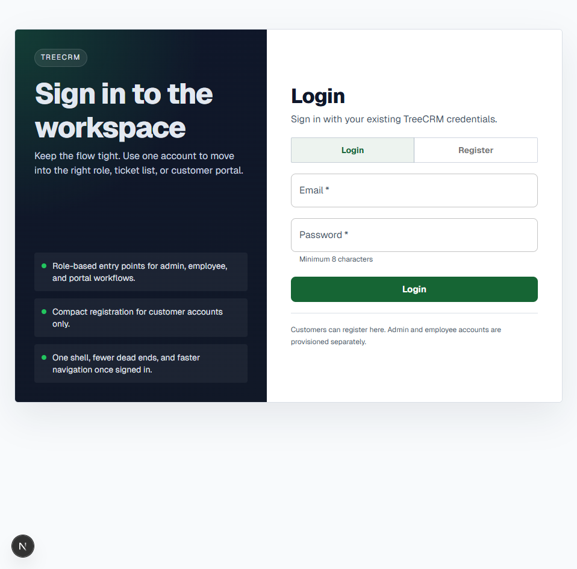

# treeCRM

[](#semantic-versioning)
[](https://nextjs.org/docs)
[](https://react.dev/)
[](https://www.typescriptlang.org/docs/)
[](https://tailwindcss.com/docs)
[](https://mui.com/material-ui/getting-started/)
[](https://expressjs.com/)
[](https://socket.io/docs/v4/)
[](https://supabase.com/docs)
[](https://www.postgresql.org/docs/)


TreeCRM is a visual CRM and support platform. The backend handles auth, RBAC, workflow rules, chat routing, notifications, metrics, and admin operations. The frontend renders the employee tree workspace, customer portal, login flow, and admin surface.

## UI Snapshot



## What This Repo Contains

- `frontend/`: Next.js 16, React 19, Tailwind 4, Material UI 7.
- `backend/`: Express 5, TypeScript, JWT auth, Socket.IO.
- `supabase/`: database-related artifacts and SQL.
- `docs/`: decision-complete implementation notes for major sessions.

## Architecture

- Frontend runs on Next.js App Router and talks to the backend over HTTP plus Socket.IO.
- Backend runs on Express and applies business rules instead of exposing raw table access to the browser.
- Supabase provides Postgres, auth, and the backing data model.
- Employees use the tree workspace. Customers use the portal. Admins use the admin workspace.

## Main Workflows

- Login and registration with role-based landing routes.
- Customer ticket creation, status tracking, chat, and CSAT submission.
- CSR case handling, notes, tags, status/priority updates, and endorsements.
- Manager and executive oversight, case reassignment, and endorsement decisions.
- Admin user, tag, and settings management.

## Role Breakdown

- `Customer`: create tickets, view status, send messages, submit CSAT.
- `CSR`: manage assigned cases, internal notes, tags, customer chat, endorsements.
- `Manager`: review team workload, approve or reject endorsements, reassign cases.
- `Executive`: review managers and broader hierarchy, inspect escalations and metrics.
- `Admin`: full access to user management, settings, and global oversight.

## Repo Layout

```text
treeCRM/
  backend/
    src/
    scripts/
    test/
  frontend/
    app/
    components/
    lib/
    test/
  docs/
  supabase/
  README.md
```

## Environment Variables

### Backend

- `PORT`
- `FRONTEND_ORIGIN`
- `SUPABASE_URL`
- `SUPABASE_KEY`
- `SUPABASE_SECRET_KEY` (preferred)
- `SUPABASE_SERVICE_ROLE_KEY` (legacy fallback)
- `JWT_SECRET`

### Frontend

- `NEXT_PUBLIC_API_URL`
- `NEXT_PUBLIC_SOCKET_URL` optional; defaults to `NEXT_PUBLIC_API_URL`

## Local Development

Run the services in separate terminals.

```bash
cd backend
npm install
npm run dev
```

```bash
cd frontend
npm install
npm run dev
```

Repo-level commands live at the root.

```bash
npm install
npm run lint
npm run build
npm test
```

## Testing

- Root `npm test` runs the deterministic local suite: backend Vitest, frontend Vitest, and frontend Playwright.
- Backend live smoke scripts stay separate under `npm run test:live`.
- Frontend browser tests use mocked API responses. They do not depend on live Supabase.
- Coverage is generated for visibility. It is not a substitute for real assertions.

### Backend

```bash
cd backend
npm run test
npm run test:coverage
npm run test:live
```

### Frontend

```bash
cd frontend
npm run test
npm run test:coverage
npm run test:e2e
```

## Deployment Targets

- Frontend: Vercel
- Backend: Render
- Database and auth: Supabase

The session history documents the production rollout path and the live verification steps already completed.

## Admin Provisioning Status

- Employee workspace account provisioning is implemented in the admin workspace.
- Additional admin creation and promotion flows are implemented with guardrails.
- Supporting planning and validation notes live in `docs/admin_account_provisioning_plan.md` and `docs/admin_account_provisioning_evidence.md`.

## Semantic Versioning

The application uses one public version for the whole repo.

- Releases are automated by `semantic-release` on pushes to `main`/`master`.
- Root `package.json` remains the canonical version source for the entire repo.
- On each release, the workflow:
  - calculates the next version from commit history (default fallback is `patch`)
  - updates root version metadata
  - runs `npm run version:sync` to update backend/frontend package metadata and README version text
  - commits release assets and tags the release as `treeCRM-v<version>`
- Local dry run command: `npm run release:dry`

Commit-message guidance for predictable bumps:
- `feat ...` in the subject -> minor bump
- subject containing `BREAKING` -> major bump
- all other commit subjects -> patch bump

## Additional Docs

- [docs/admin_account_provisioning_plan.md](docs/admin_account_provisioning_plan.md)
- [docs/admin_account_provisioning_evidence.md](docs/admin_account_provisioning_evidence.md)
- [docs/session_12_skill_tree_plan.md](docs/session_12_skill_tree_plan.md)
- [docs/session_14_tree_view_ui_fixes_plan.md](docs/session_14_tree_view_ui_fixes_plan.md)
