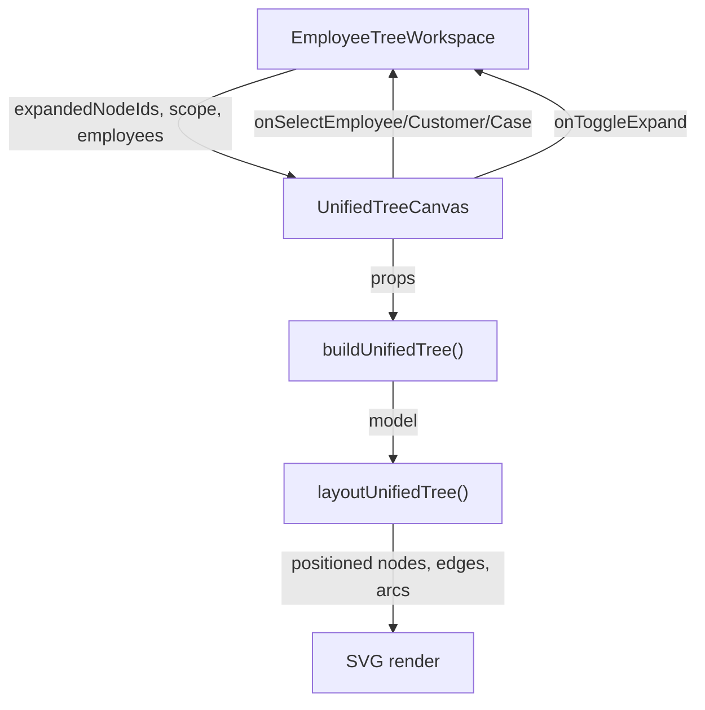

# Session 13 — Unified Infinite-Canvas Tree Visualization

## What Changed

Replaced the two separate graph panels (Employee Hierarchy + CSR Skill Tree) with a single unified infinite-canvas tree view.

### Files Modified

| File | Change |
|------|--------|
| [employeeGraph.ts](file:///d:/Desktop/Main/Files/Programming/Projects/treeCRM/frontend/lib/employeeGraph.ts) | Added [UnifiedTreeNode](file:///d:/Desktop/Main/Files/Programming/Projects/treeCRM/frontend/lib/employeeGraph.ts#195-222), [UnifiedTreeEdge](file:///d:/Desktop/Main/Files/Programming/Projects/treeCRM/frontend/lib/employeeGraph.ts#223-229), [UnifiedTreeModel](file:///d:/Desktop/Main/Files/Programming/Projects/treeCRM/frontend/lib/employeeGraph.ts#230-235) types and [buildUnifiedTree()](file:///d:/Desktop/Main/Files/Programming/Projects/treeCRM/frontend/lib/employeeGraph.ts#250-448) builder |
| [graphLayout.ts](file:///d:/Desktop/Main/Files/Programming/Projects/treeCRM/frontend/components/graph/graphLayout.ts) | Added [layoutUnifiedTree()](file:///d:/Desktop/Main/Files/Programming/Projects/treeCRM/frontend/components/graph/graphLayout.ts#349-499) layout engine with fan-out + priority ring positioning |
| [EmployeeTreeWorkspace.tsx](file:///d:/Desktop/Main/Files/Programming/Projects/treeCRM/frontend/components/EmployeeTreeWorkspace.tsx) | Replaced dual canvas imports/state with unified canvas, `expandedNodeIds` replaces `focusedCsrEmployeeId`/`focusedCustomerId` |

### Files Created

| File | Purpose |
|------|---------|
| [UnifiedTreeCanvas.tsx](file:///d:/Desktop/Main/Files/Programming/Projects/treeCRM/frontend/components/graph/UnifiedTreeCanvas.tsx) | Infinite-canvas SVG component with pan/zoom, node rendering, priority arcs, expand/collapse |

### Architecture

## Validation

- **Lint**: 0 errors, 2 non-blocking warnings
- **Build**: All pages compile successfully with TypeScript + Next.js 16

## Manual Testing Required

1. CSR login → tree centered on CSR with customers as children, click customer to expand cases in priority rings
2. Manager login → tree centered on Manager with CSRs as children, drill CSR → Customer → Cases  
3. Executive login → progressive drill Manager → CSR → Customer → Cases
4. Pan (drag) and zoom (scroll wheel), Reset View button
5. Node selection → detail panel populates correctly
